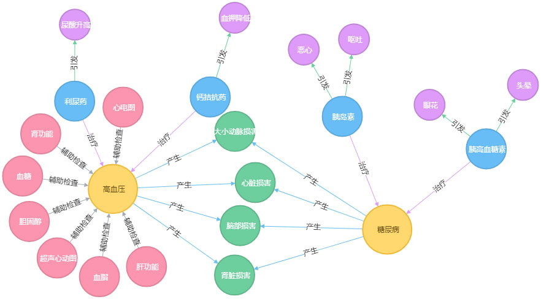
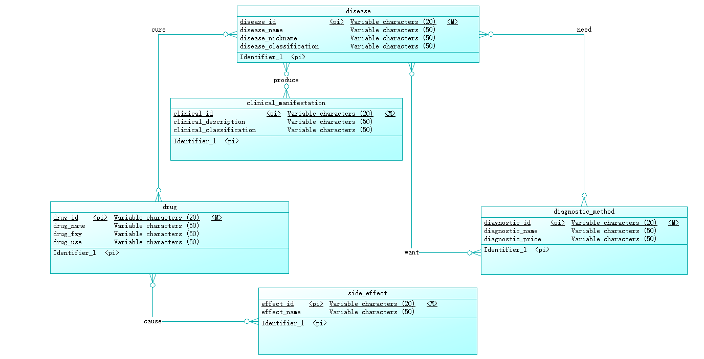

## python操作Neo4j建立医药知识图谱

效果如下图所示:


疾病、药物等数据在关系型数据库中的ER图如下所示:


为了更加直观的了解数据之间的关系，将上述的关系型数据通过python程序转存到图数据库Neo4j中.

* 创建实体
```
from py2neo import Node
def create_node(self):
    # 疾病、临床表现、药物等结点定义
    for each_dis in dis_list:
        dis_node=Node(dis_label,name=each_dis)
        self.graph.create(dis_node)

    for each_cli in cli_list:
        cli_node = Node(cli_label, name=each_cli)
        self.graph.create(cli_node)

    for each_sdef in drug_list:
        drug_node = Node(dru_label, name=each_sdef)
        self.graph.create(drug_node)

    for each_sdef in sdef_list:
        sdef_node=Node(side_effect_label,name=each_sdef)
        self.graph.create(sdef_node)

    for each_zd in zd_method_list:
        zd_node=Node(diagnostic_label,name=each_zd)
        self.graph.create(zd_node)
```

* 创建实体间的关系
```
from py2neo import Relationship
def create_Rel(self):
    """
    建立关系
    高血压疾病与临床表现之间的双向关系定义
    :return:
    """
    # 获取高血压与糖尿病结点，然后通过循环，建立这两个疾病与临床表现的关系
    hyp_node = self.graph.find_one(
        label=dis_label,
        property_key="name",
        property_value="高血压"
    )
    tnb_node = self.graph.find_one(
        label=dis_label,
        property_key="name",
        property_value="糖尿病"
    )
    # 建立疾病与临床表现的关系
    for cli_name in cli_list:
        cli_node = self.graph.find_one(
            label=cli_label,
            property_key="name",
            property_value=cli_name
        )
        hyp_to_cli = Relationship(hyp_node, '产生', cli_node)
        self.graph.create(hyp_to_cli)
        tnb_to_cli = Relationship(tnb_node, '产生', cli_node)
        self.graph.create(tnb_to_cli)
    # 建立疾病与诊断方法之间的关系
    for diag_name in zd_method_list:
        diag_node = self.graph.find_one(
            label=diagnostic_label,
            property_key="name",
            property_value=diag_name
        )
        if diag_name=="血糖" and diag_name=="血脂" and diag_name=="胆固醇":
            diag_to_dis = Relationship(diag_node, '辅助检查', tnb_node)
        else:
            diag_to_dis = Relationship(diag_node, '辅助检查', hyp_node)
        self.graph.create(diag_to_dis)
    # 建立疾病与药物关系
    for drug_name in drug_list:
        drug_node = self.graph.find_one(
            label=dru_label,
            property_key="name",
            property_value=drug_name
        )
        if drug_name=="胰岛素" or drug_name=="胰高血糖素":
            drug_to_disease=Relationship(drug_node,'治疗',tnb_node)
        else:
            drug_to_disease= Relationship(drug_node, '治疗', hyp_node)
        self.graph.create(drug_to_disease)

    # 建立药物与副作用之间的关系
    for drug_name in drug_list:
        drug_node = self.graph.find_one(
            label=dru_label,
            property_key="name",
            property_value=drug_name
        )
        for sdef_name in sdef_list:
            sdef_node = self.graph.find_one(
                label=side_effect_label,
                property_key="name",
                property_value=sdef_name
            )

            if drug_name == "利尿药" and sdef_name == "尿酸升高":
                drug_to_sdef = Relationship(drug_node, '引发', sdef_node)
                self.graph.create(drug_to_sdef)
            elif drug_name == "钙拮抗药" and sdef_name == "血钾降低":
                drug_to_sdef = Relationship(drug_node, '引发', sdef_node)
                self.graph.create(drug_to_sdef)
            elif drug_name == "胰岛素" and (sdef_name == "恶心" or sdef_name == "呕吐"):
                drug_to_sdef = Relationship(drug_node, '引发', sdef_node)
                self.graph.create(drug_to_sdef)
            elif drug_name == "胰高血糖素" and (sdef_name == "头晕" or sdef_name == "眼花"):
                drug_to_sdef = Relationship(drug_node, '引发', sdef_node)
                self.graph.create(drug_to_sdef)
```